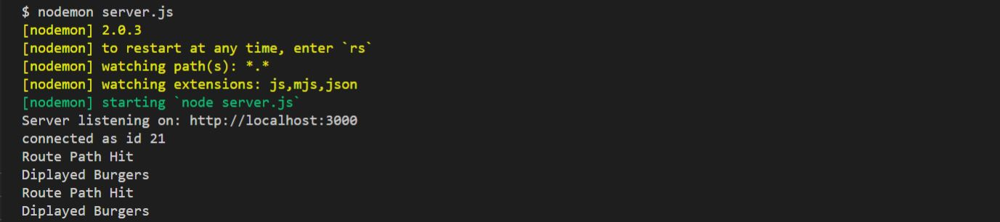
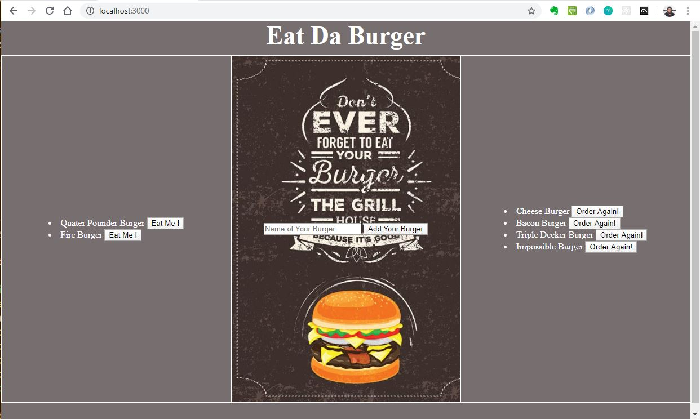

# Unit 13  - Eat-Da-Burger-Node-Express-Handlebars

Table of Contents
* [Project Goal]
* [Installation of dependencies]
* [Challenges]
* [How to use the Application ?]
* [License]
* [Contributing Authors]
* [Author]
* [Tests]

## Project Goal

Eat-Da-Burger! is a restaurant app that lets users input the names of burgers they'd like to eat.
Whenever a user submits a burger's name, your app will display the burger on the left side of the page -- waiting to be devoured. Each burger in the waiting area also has a `Devour it!` button. When the user clicks it, the burger will move to the right side of the page. Your app will store every burger in a database, whether devoured or not.

## Installation of dependencies
Run Install npm install OR:
1. Install the Express npm package: `npm install express`.
2. Install the Handlebars npm package: `npm install express-handlebars`.
3. Install MySQL npm package: `npm install mysql2`.
4. Install Meethod-Override npm package: `npm install method-override`.

## Challenges
I got very late in completing my Homework these past weeks.
Several issues arose on my end and I had a little quality time to get these homework correctly completed.
Rendering the final HTML file took me a lot of time to correctly ( I hope) get right.
I did not run the required tests as I was running out of time to complete this.

### How to use the application ?
In the terminal windows : RUN "node server.js"
See the related screenshot images in ./images/ folder

## License 
MIT License

### Contributing Authors
None

### Author
Abel Savoeda
Email: null
Location:Ottawa, ON
GitHub: https://github.com/savabel

### Tests
See the related screenshot images in ./images/ folder

